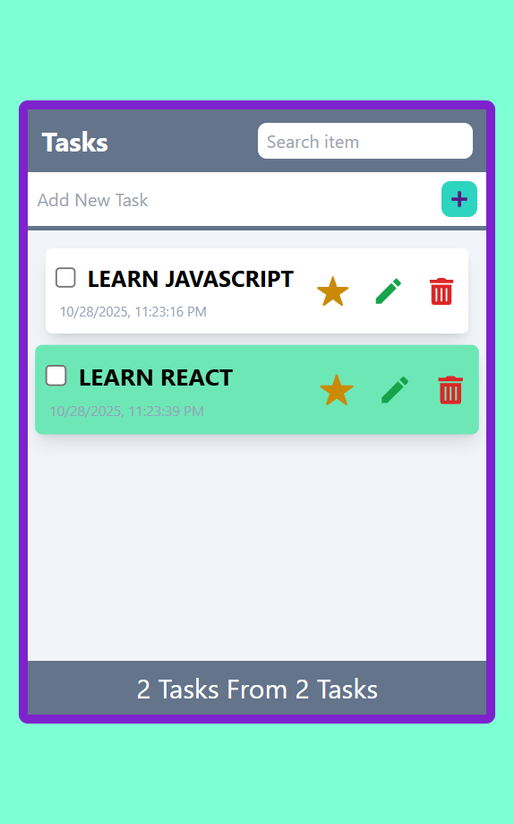
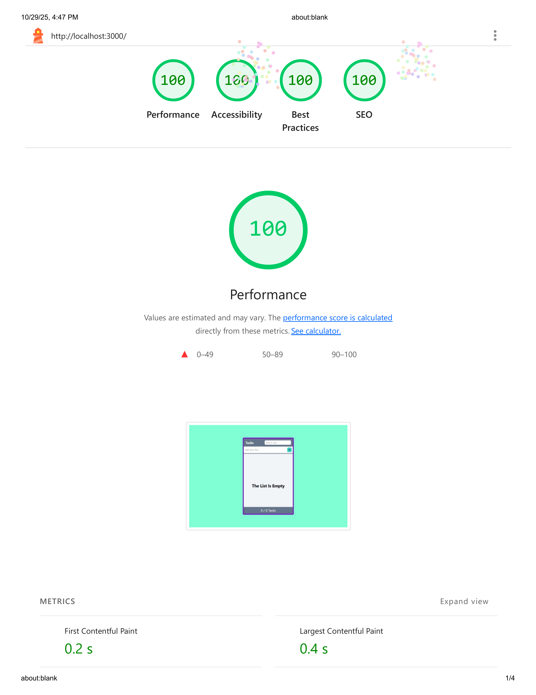

✅ To-Do List App (React + Context API + Reducer)

A modern and responsive Task Management App built with React, Context API, and useReducer, allowing you to add, edit, delete, and mark tasks as important or completed — with full local storage persistence.

---

🚀 Live Demo

👉 https://github.com/ahmednabil22224/To-Do-App-React

---

⚙️ Features

- 🧩 Context API + useReducer for clean and scalable state management
- 💾 Local Storage — tasks are saved even after page refresh
- 🌗 Responsive Design using Tailwind CSS
- ✨ Add, Delete, Update, and Mark Tasks
- ⭐ Mark tasks as Important
- ✅ Check or Uncheck completed tasks
- 🕵️‍♂️ Search tasks easily
- 🧱 Clean folder structure (hooks/, components/, tasks/)

---

## 🧠 Tech Stack

- Category Tools
- Frontend React (Functional Components + Hooks)
- State Management Context API + useReducer
- Styling Tailwind CSS
- Storage Browser LocalStorage
- Build Tool Create React App
- Icons React Icons

---

```
📂 Folder Structure
src/
│
├── components/
│   ├── AddTask.jsx
│   ├── Footer.jsx
│   ├── Header.jsx
│   ├── OverlayModal.jsx
│   ├── Task.jsx
│   └── FullTasks.jsx
│
├── hooks/
│   ├── TasksContext.jsx
│   └── TasksReducer.jsx
│
├── images/
│   ├── screenshot.png
│   └── lighthouse-report.png
│
├── App.jsx
├── index.js
└── styles/
    └── tailwind.css
```

---

## 📸 Preview

**Desktop View**


```

## 🌟 Lighthouse Report

| Metric            | Score |
| ----------------- | ----- |
| ⚡ Performance    | 100%   |
| ♿ Accessibility  | 100%  |
| 🛡️ Best Practices | 100%  |
| 🔍 SEO            | 100%  |

images/lighthouse-report.png
```

## ⚡ Lighthouse Report



---

🧩 Tested with production build served using serve -s build and Chrome Incognito mode.

🧰 Installation & Setup

1️⃣ Clone the repository

```bash
git clone https://github.com/ahmednabil22224/To-Do-App-React.git

```

2️⃣ Install dependencies

npm install

3️⃣ Run in development mode

npm start

App runs on http://localhost:3000

4️⃣ Build for production

npm run build

5️⃣ Serve locally (to test production build)

npm install -g serve
serve -s build

---
